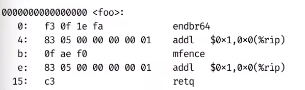

# 什么是程序与编译器
## 状态机
图示：\
数字电路模拟器
```c
#include <stdio.h>
#include <unistd.h>
#define REGS_FOREACH(_) _(X) _(Y)
#define RUN_LOGIC X1 =! X&& Y;\//推动状态机的改变
                  Y1 =! X && Y;
#define DEFINE static int X,X##1;//定义两个数值
#define UPDATE(X) X = X##1;//更新数据
#define PRINT(X) printf("# X=%d",X);
int main()
{
    REGS_FOREACH(DEFINE);
    while(1){
        RUN_LOGIC;
        REGS_FOREACH(PRINT);
        REGS_FOREACH(UPDATE);
        putchar('\n');
        sleep(1);
    } 
}
```
## 程序
### 源代码视角
程序的本质也是一个状态机\
状态 = 堆+桟\
初始状态 main+第一条语句\
状态执行一条语句\
    函数调用 函数返回 入桟与出桟\
    利用宏展开与循环可以模仿任意的递归函数  入桟与出桟的操作\
   \
   图示为将递归的汉诺塔转化为非递归的形式。
   ### 二进制视角
   状态 = 内存 + 寄存器\
   初始状态 = \
   状态转移 执行一条指令\
   程序指令大多数只是负责计算，syscall是一条特殊的指令。将当前进程所有资源与运行的状态交给操作系统并由操作系统执行相应的操作。操作系统通过访问硬件完成改变状态。
   ### 思考如何构建一个最小的helloworld
   程序运行中需要链接外部库。即是代码看起来不长，但依然需要占用大量的内存空间。\
   方案一：直接强行编译链接。绕过对外部库的链接。\
   问题：ld不知道如何链接库函数\
   方案二：使用空的main函数\
   问题：发生段错误，链接时产生了警告\
   正确的思想：通过系统调用完成程序的读写以及退出。syscall中不同的系统调用对应不同的系统调用号和宏。
   ### 两种视角上的切换
   通过编译器将c语言代码汇编变成汇编代码。
   正确的编译，不可优化的翻译之后语意一一对应。除此之外编译器可以做任意的优化使代码的运行效率更高。\
   以下两段代码使用不同的内联汇编指令得到的结果也不同。
   ```c
   void foo(int x)
   {
        g++;
        asm volatile("nop" :: "r"(x) );
        g++;
   }
   ```
结果1：\

   ```c
   void foo(int x)
   {
        g++;
        asm volatile("nop" :: "r"(x) : "memory");
        g++;
   }
   ```
   结果2：\
   \
   asm：这是内嵌汇编的开始。\
volatile：这个关键字告诉编译器不要优化此汇编代码，确保它按照指定的方式执行。\
"nop"：这是实际的汇编指令，即空操作。\
"::"：这两个冒号之间的部分是输出操作数和输入操作数列表，但在这个代码中没有输出操作数。\
"r"(x)：这是一个输入操作数约束。它告诉编译器将变量 x 放入一个通用寄存器（register）中，以供汇编指令使用。\
"memory"：这是一个内存约束。它告诉编译器，汇编指令可能会影响内存，因此编译器不应该进行过多的优化，以确保内存访问的正确性。\
在加入memory之后两条g++并没有被优化复用，而是保持原样。\
操作系统对于应用：操作系统对于程序来说只是一个系统调用的api。程序通过使用syscall来访问系统资源，诸如文件设备其他进程等等。
