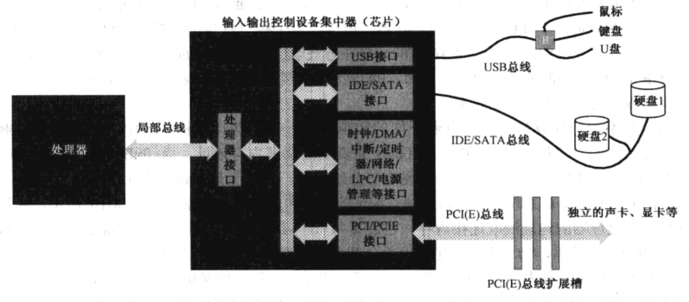
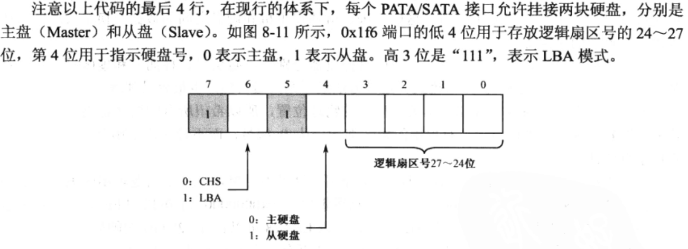
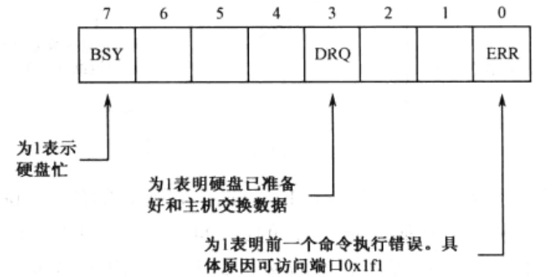

# 基本汇编指令
## 运算类
整数运算：
ADD：加法操作，可以对两个操作数进行相加。\
SUB：减法操作，可以对两个操作数进行相减。\
IMUL：有符号整数乘法，执行有符号整数的乘法操作。\
MUL：无符号整数乘法，执行无符号整数的乘法操作。\
IDIV：有符号整数除法，执行有符号整数的除法操作。\
DIV：无符号整数除法，执行无符号整数的除法操作。若为16位除法，被除数放在ax中。除完后余数在ah,商在al。若为32位除法被除数放在dx和ax中。除完后余数在dx中，商在ax中\
INC：递增操作，将操作数增加1。\
DEC：递减操作，将操作数减少1。\
逻辑运算：\
AND：按位与操作，对两个操作数的每一位执行与运算。有0即0\
OR：按位或操作，对两个操作数的每一位执行或运算。有1即为1，全0则为0\
XOR：按位异或操作，对两个操作数的每一位执行异或运算。相同为0,相反为1\
NOT：按位取反操作，对操作数的每一位执行取反运算。\
TEST：按位与测试操作，将两个操作数相与，但不保存结果，用于设置标志位。\
移位和旋转：\
SHL 或 SAL：左移操作，将操作数向左移动指定的位数。\
SHR：无符号右移操作，将操作数向右移动指定的位数。\
SAR：有符号右移操作，将操作数向右移动指定的位数，保留符号位。\
ROL：循环左移操作，将操作数向左循环移动指定的位数。\
ROR：循环右移操作，将操作数向右循环移动指定的位数。\
比较指令：\
CMP：比较操作，用于比较两个操作数的值，并设置相应的标志位，通常与条件跳转指令一起使用。\
## 流程控制
无条件跳转：\
JMP：无条件跳转指令。它允许程序无条件地跳转到指定的目标地址。\
条件跳转：\
JE（Jump if Equal）：如果前一个比较指令中的两个操作数相等，则跳转。\
JNE（Jump if Not Equal）：如果前一个比较指令中的两个操作数不相等，则跳转。\
JZ（Jump if Zero）：如果前一个操作结果为零，则跳转。\
JNZ（Jump if Not Zero）：如果前一个操作结果不为零，则跳转。\
JG（Jump if Greater）：如果前一个比较中的左操作数大于右操作数，则跳转。\
JGE（Jump if Greater or Equal）：如果前一个比较中的左操作数大于等于右操作数，则跳转。\
JL（Jump if Less）：如果前一个比较中的左操作数小于右操作数，则跳转。\
JLE（Jump if Less or Equal）：如果前一个比较中的左操作数小于等于右操作数，则跳转。\
这些条件跳转指令通常用于控制程序的分支和决策。它们根据特定的条件（例如，相等、大于、小于等）来判断是否跳转到目标地址。

无条件远跳转：\
CALL：用于跳转到一个子程序（函数）的地址，同时保存返回地址以便返回。\
RET：用于从子程序返回到调用它的地址，通常与CALL一起使用。\
RETF与ret类似，但是从桟内弹出两个数据，一个是段地址，一个是偏移地址。\
ret也可以不和call连用，其本质就是将栈顶数据出桟并跳转到该段位置执行。\
其他跳转指令：

LOOP：在循环中使用，根据ECX寄存器的值来控制循环的次数。\
INT：用于触发中断处理程序，根据中断号跳转到相应的中断处理程序。
## IO端口访问与常用端口
当计算机要访问外设时通过两个关键技术完成对于外设的访问。\
一个为总线技术，总线为外设提供与计算机随时连接与断开\
一个为输入输出集中控制处理器ICH芯片，连接不同的总线并协调各个I/O接口对于处理器的访问

通过I/O端口读取外设数据
```asm
in al,0xf0
```
通过I/O端口向外设写入数据
```asm
out 0x37,ax
```
### 磁盘
磁盘的端口分配，八位端口。0x1f0到0x1f7\
指定读写扇区的数量，0x1f2端口\
存放逻辑扇区编号，0x1f3~0x1f6\
0x1f6的后四位：

命令端口与状态端口，0x1f7。向内写0x20为读指令。状态表示如下：

### 显卡
显卡内部寄存器繁多操作复杂。访问显卡中的寄存器需要通过索引寄存器来访问，向索引寄存器中填入待访问显卡中寄存器的索引号。索引寄存器的端口号为0x3d4。

## 中断
开启中断：sli
关闭中断：cli
## 寻址方式
16位：十六位实模式下，共有20位地址线，采取基地址右移四位加偏移地址的寻址方式
32位：32位下，操作系统维护了描述符表（GDT）通过该表确定了不同内存段位置大小以及访问权限等等信息。\
在进入保护模式之前，需要将先将gdt初始化。
LGDT 指令是x86汇编语言中的一个指令，用于加载全局描述符表（Global Descriptor Table）的地址和界限值。全局描述符表是x86体系结构中用于管理段描述符的数据结构，用于定义内存段的属性和位置。

LGDT 指令的语法如下：
```asm
LGDT [GDT_descriptor]
```
[GDT_descriptor] 是一个内存地址，指向一个包含全局描述符表信息的数据结构。这个数据结构通常包括全局描述符表的基址（地址）和界限（大小）。
LGDT 指令的执行过程如下：

从指定的内存地址 [GDT_descriptor] 读取全局描述符表的基址和界限。
将读取到的基址和界限加载到全局描述符表寄存器 GDTR 中。
此后，CPU 使用 GDTR 中的信息来访问全局描述符表，以获取关于各个段（如代码段、数据段等）的描述符信息。
全局描述符表包含了描述内存段的段描述符，每个段描述符包括段的起始地址、大小、访问权限等信息。通过加载 GDTR 寄存器，CPU 可以使用这些信息来执行内存分段和保护。
在进入保护模式之后，对于内存的访问，先将对应的全局描述符索引放入段寄存器中。32位的段寄存器分为段选择器和描述符高速缓存器两个部分。全局描述符索引会找到对应的全局描述符并将描述符中保存的内容放入高速缓存器中。之后访问内存只需要提供16位逻辑地址就可以