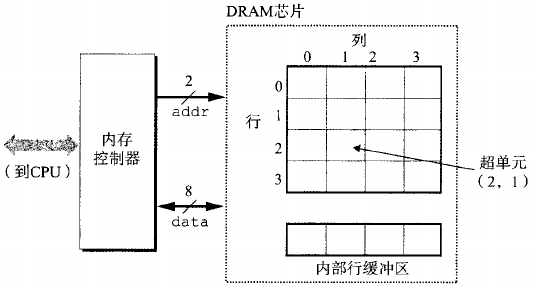
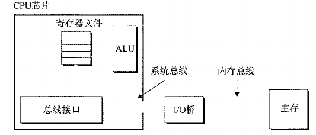
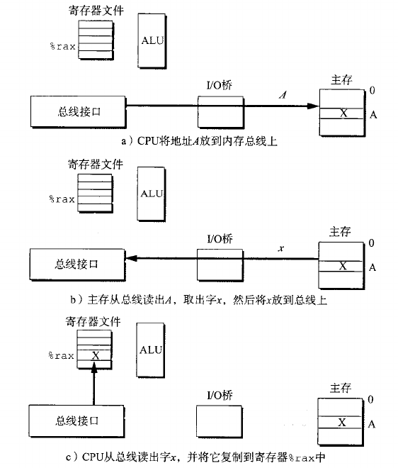
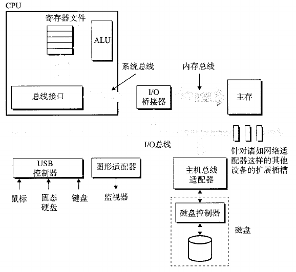

# 存储层次结构
## RAM
随机访问存储器( RAM ) 分为两类 :静态的和动态的。RAM的缺点是信息容易遗失。断电后信息会被清除。
 ### DRAM
 DRAM 芯片中的单元(位) 被分成 d 个超单元 ( supercell ) ,每个超单元都由 w 个 DRAM 单元组成 。一个 DRAM 总共存储了dw位信息。\
 设计成二维的好处是可以减少引脚的使用，但是也会增加访问内存的时间。
 
 ## ROM
非易失性存储器 ( nonvolatile memory )即使是在关电后 , 仍然保存着它们的信息。存储在 ROM 设备中的程序通常被称为固件 ( firmware ) 。 当一个计算机系统通电以后 ,它会运行存储在 ROM中的固件 。一些系统在固件中提供了少量基本的输人和输出函
数例如 PC 的 BIOS ( 基本输人 / 输出系统 ) 例程 。
## 访问主存
cpu对主存的访问通过 I/O 桥与总线访问。内存总线连接内存与 I/O 桥，系统总线连接cpu与I/O桥。

## 磁盘
磁盘构造复杂，对于操作系统来说，为了简化操作，磁盘将他们从1 到 n 进行编号。由磁盘中的控制器维护物理磁盘与逻辑块号之间的映射关系。
## I/O设备的访问
对于外设的访问通过 I/O 总线访问各种外设虽然 I/O 总线比系统总线和内存总线慢 , 但是它可以容纳种类繁多的第三方 I/O 设备。CPU 使用一种称为内存映射的技术来向 I / O 设备发射命令。 在使用内存映射 I / O 的系统中 , 地址空间中有一块地址是为与 I/ O 设备通信保留的。 每个这样的地址称为一个 I/ O 端口。当一个设备连接到总线时,它与一个或多个端口相关联。
