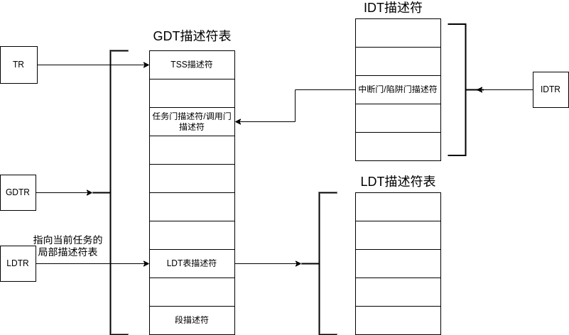

# 用户进程
## 为什么需要用户进程
## LDT
在每个用户进程中，被加载的代码都有自己的段，每个任务内的分段情况被记录在同一个LDT表中。\
每个任务对应的LDT的表都会有一个对应的描述符被安装在GDT中。\

当任务被执行时，会在GDT中找到当前任务的LDT描述符，并将LDT描述符加载到LDTR寄存器中。\
  

在 LDT 中,描述符的 D 位和 L 位固定为 0 。
操作LDTR的指令：
```asm
lldt (16位选择子);将选择子加载到LDTR中
```
### 为什么ldt有第0位但是GDT没有？
>为什么 GDT 中第 0 个段描述符不可用?
这么做的原因很简单,是担心选择子未初始化,这种未初始化的选择子其值为 0 ,因此会选择到 GDT 中的第 0 个段描述符,若选择到 GDT 中的第 0 个段描述符, CPU 便知道这是选择子未初始化造成的,于是通过抛异常来发现这种错误。要是从 LDT 中选择段描述符时,选择子的 TI 位必须为 1 ,这就确保了只有经过显式地初始化后才能从 LDT 中检索描述符,不存在忘记初始化的情况,因此 LDT 中的第 0 个段描述符是可用的。
## TSS段
TSS段的结构：\
  
当任务被嵌套调用时，存在任务调用链。\
  

## LDT TSS 的区别
两者都是任务切换的依据，他们之间存在什么区别与联系？\
LDT 中保存的是任务自己的实体资源,也就是数据和代码\
TSS 中保存的是任务的上下文状态及三种特权级的战指针、 1/0 位图等信息。
## 整体的布局
 
  
## 进程切换过程
进行任务切换的方式有“中断+任务门”,“ call 或 jmp+任务门”和 iretd。\
1. 通过“中断+任务门”进行任务切换
* 实现简单。
* 抢占式多任务调度,所有任务都有运行的机会。

(1)从该任务门描述符中取出任务的 TSS 选择子。\
(2)用新任务的 TSS 选择子在 GDT 中索引 TSS 描述符 。\
(3)判断该 TSS 描述符的 P 位是否为 1 ,为 1 表示该 TSS 描述符对应的 TSS 己经位于内存中 TSS 描
述符指定的位置,可以访问。否则 P 不为 1 表示该 TSS 描述符对应的 TSS 不在内存中,这会导致异常。\
(4)从寄存器 TR 中获取旧任务的 ·Tss 位置,保存旧任务(当前任务)的状态到旧 TSS 中 。 其中,
任务状态是指 CPU 中寄存器的值,这仅包括 TSS 结构中列出的寄存器: 8 个通用寄存器, 6 个段寄存器,
指令指针 eip ,战指针寄存器 esp ,页表寄存器 cr3 和标志寄存器 eflags 等。\
(5)把新任务的 TSS 中的值加载到相应的寄存器中。\
(6)使寄存器 TR 指向新任务的 TSS。\
(7)将新任务(当前任务)的 TSS 描述符中的 B 位置 1。\
(8)将新任务标志寄存器中 eflags 的 NT 位置 1。\
(9)将旧任务的 TSS 选择子写入新任务 TSS 中“上一个任务的 TSS 指针”宇段中。\
(10)开始执行新任务。\
在任务切换时如果一直切换tr寄存器中的值，造成的开销较大。因此在系统的实现中一般只替换tss段中的内容，但是并不切换tr中实际指向的地址。
# 用户进程原理
用户进程实现与内核线程之间最大的差别就是内核线程没有独立的空间，而用户进程具有独立的虚拟地址空间。