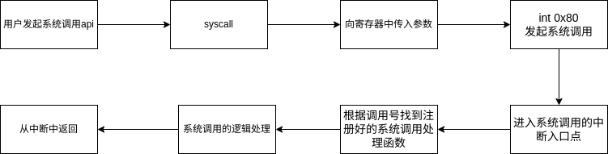

# 系统调用的实现
在本系统中，对于系统调用的实现采取中断的形式。
## 系统调用号
在发起系统调用时，我们如何让操作系统知道我们调用的是什么函数？\
在这里我们引入系统调用号的意思，每个系统调用都有自己对应的系统调用号。\
在进行系统调用时只要我们将系统调用号一并传入，就可以根据系统调用号推算出对应的系统调用。
```c
enum SYSCALL_NR {//表示不同系统调用号
    SYS_GETPID,
    SYS_WRITE,
    SYS_MALLOC,
    SYS_FREE,
    SYS_FORK,
    ...
};
```
## 系统调用的流程
  
由该图，我们可以看出要实现系统调用的几个关键点:
* 实现syscall函数
* 在中断入口中增加系统调用入口
* 注册系统调用对应的处理函数
## syscall函数的实现
###  通过寄存器实现
在syscall中我们需要将中断号以及系统调用的处理函数都传递给系统调用的处理函数之中。\
根据syscall的参数数量我们可以将syscall分为四种。\
我们使用宏来实现syscall\
无参数：
```c
#define syscall0(NUMBER)({\
    int retval;\
    asm volatile(\
        "int $0x80;      \  //调用系统调用中断号
        :"=a"(retval);   \ //eax中保存了系统调用的返回结果，将eax中的结果放入内存区域retval中
        :"a"(NUMBER);    \ //将系统调用号放入eax中
        :"memory"\
    )
    return retval;\
})
```
有参数：
```c
#define _syscall3(NUMBER, ARG1, ARG2, ARG3) ({		       \
   int retval;						       \
   asm volatile (					       \
      "int $0x80"					       \
      : "=a" (retval)					       \
      : "a" (NUMBER), "b" (ARG1), "c" (ARG2), "d" (ARG3)       \
      : "memory"					       \
   );							       \
   retval;						       \
})
```
在有参数时依次将参数存入寄存器中ebx,ecx,edx中即可。
### 通过栈实现

在本系统的实现中我们采取寄存器的实现方式。使用栈还需在中断时找到esp3的位置并从中获取栈中的系统调用的参数。
## 系统调用中断入口的实现
定义入口函数：
```asm
extern syscall_table;定义全局变量，在该数组中注册系统调用对应的中断处理函数
section .text
global syscall_handler;定义全局函数syscall_handler，将该函数地址注册到idt中
syscall_handler:
;1 保存上下文环境
   push 0			    ; 压入0, 使栈中格式统一

   push ds
   push es
   push fs
   push gs
   pushad			    ; PUSHAD指令压入32位寄存器，其入栈顺序是:
				    ; EAX,ECX,EDX,EBX,ESP,EBP,ESI,EDI 
				 
   push 0x80			    ; 此位置压入0x80也是为了保持统一的栈格式

;2 为系统调用子功能传入参数
   push edx			    ; 系统调用中第3个参数
   push ecx			    ; 系统调用中第2个参数
   push ebx			    ; 系统调用中第1个参数

;3 调用子功能处理函数
   call [syscall_table + eax*4]	    ; 编译器会在栈中根据C函数声明匹配正确数量的参数
   add esp, 12			    ; 跨过上面的三个参数

;4 将call调用后的返回值存入待当前内核栈中eax的位置
   mov [esp + 8*4], eax	;往前八个正好是在中断时压入栈中的eax的位置，将系统调用的返回值放入此处返回
   jmp intr_exit		    ; intr_exit返回,恢复上下文
```
实现后要将系统调用中断入口地址通过中断门描述符保存到idt中
```c
static void idt_desc_init(void) {
   int i, lastindex = IDT_DESC_CNT - 1;
   for (i = 0; i < lastindex; i++) {
      make_idt_desc(&idt[i], IDT_DESC_ATTR_DPL0, intr_entry_table[i]); 
   }
/* 单独处理系统调用,系统调用对应的中断门dpl为3,
 * 中断处理程序为单独的syscall_handler */
   make_idt_desc(&idt[lastindex], IDT_DESC_ATTR_DPL3, syscall_handler);//将上文中定义的syscall_handler函数地址填写到中断门中
   put_str("   idt_desc_init done\n");
}
```
## 注册系统调用函数
在sysinit函数中实现系统调用处理函数的注册
```c
void syscall_init(void) {
   put_str("syscall_init start\n");
   syscall_table[SYS_GETPID]	    = sys_getpid;
   syscall_table[SYS_WRITE]	    = sys_write;
   ...
   put_str("syscall_init done\n");
}
```
其中sys_getpid等均为系统调用对应的处理函数，其中是对该调用的逻辑处理
# printf的实现
## 可变参数原理
在c语言的函数调用中使用可以栈来传递参数。
```c
uint32_t printf(const char* str, ...);
```
其中省略号表示不知道数量的参数。\
虽说可以使用...来未知数量的表示参数。但是真正实现printf的函数还是要知道参数数量和具体内容的，毕竟我们要将str参数中的占位符全部替换成参数内容。\
那么我们如何得知具体有几个参数，各个参数都代表了哪些类型？\
在上文中我们提到，在参数未知的情况下，通过栈来传参。调用发起者会将参数从左到右依次压入栈中。
在这里我们借助三个宏来实现。
```c
#define va_start(ap, v) ap = (va_list) & v  // 把ap指向第一个固定参数v
#define va_arg(ap, t) *((t*)(ap += 4))  // ap指向下一个参数并返回其值
#define va_end(ap) ap = NULL            // 清除ap
```