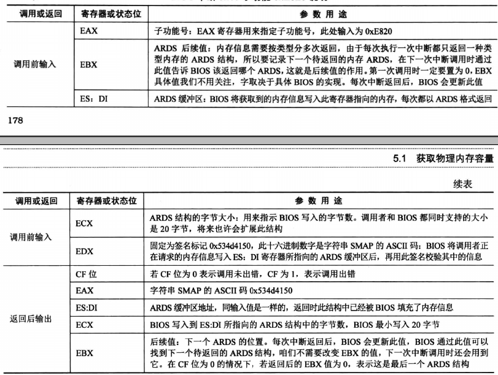
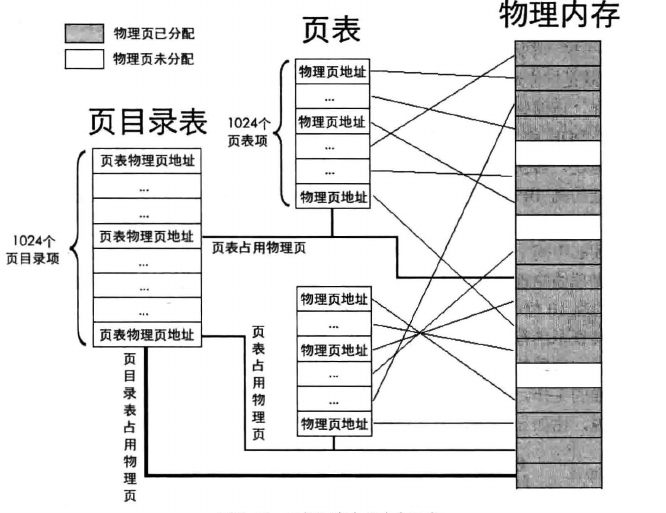
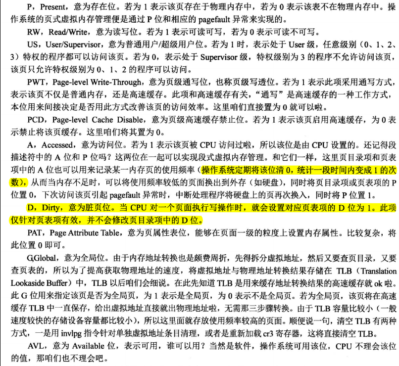
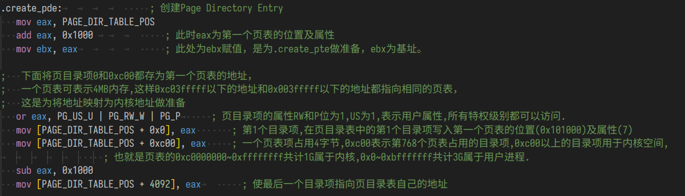
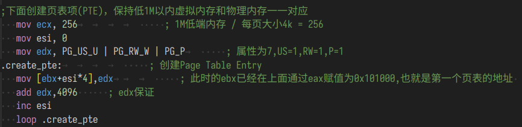
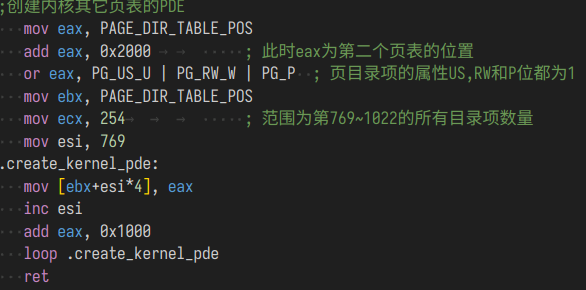
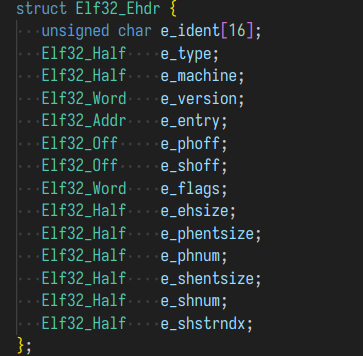

# 获取内存容量
>在 Linux 中有多种方法获取内存容量,如果一种方法失败,就会试用其他方法。比如在 Linux 2.6 内核
中,是用 detect_memory 函数来获取内存容量的。其函数在本质上是通过调用 BIOS 中断 Ox15 实现的,分别
是 BIOS 中断 Ox15 的 3 个子功能,子功能号要存放到寄存器 EAX 或 AX 中,如下。\
•
 EAX=OxE820 :遍历主机上全部内存。\
•
 AX=OxE801:
 分别检测低 1 见面和 16孔但~4GB 的内存,最大支持 4GB 。\
•
 AH=Ox88 :最多检测出 64MB 内存,实际内存超过此容量也按照 64MB 返回。

 ## 0xE820
   

# 分页机制
## 为什么要启用内存分页机制
1.防止内存碎片化\
2.当内存不够时将长期不使用的进程及时换出至磁盘中保存。
## 如何表示
页表分为两级
  
(1 )用虚拟地址的高 10 位乘以 4 ,作为页目录表内的偏移地址,加上页目录表的物理地址,所得的
和,便是页目录项的物理地址。读取该页目录项,从中获取到页表的物理地址。\
(2 )用虚拟地址的中间 1 0 位乘以 4 ,作为页表内的偏移地址,加上在第 1 步中得到的页表物理地址,
所得的和,便是页表项的物理地址。读取该页表项,从中获取到分配的物理页地址。 \
(3 )虚拟地址的高 10 位和中间 10 位分别是 PDE 和 PIE 的索引值,所以它们需要乘以 4 。但低 12 位
就不是索引值啦,其表示的范围是 0 ~ Ox筒,作为页内偏移最合适,所以虚拟地址的低 12 位加上第 2 步
中得到的物理页地址,所得的和便是最终转换的物理地址。由 MMU 运算。\
每个进程都有自己的页表，一整个页表可以表示一整个4GB的虚拟地址，任务在切换时,页表也需要跟着切换。\
页表后12位为标志位。
## 页表项中的表示位
  
## 开启分页机制
(1 )准备好页目录表及页表。\
(2 )将页表物理地址写入控制寄存器cr3 。\
(3 )寄存器cr0的PG位置1 。
## 构建映射关系
构建页目录项：
  
在第0项和第768项都填入第一个页表的地址，在页目录的最后一项填入页目录自己的地址。以后可以通过尾项指到首项的方式来访问自己。
为什么要同时将最低处和0x80000000这两个虚拟地址。\
在加载内核之前，程序中运行的一直都是 loader，它本
身的代码都是在 1MB 之内，必须保证之前段机制下的线性地址和分页后的虚拟地址对应的物理地址一致。\
第 0 个页目录项代表的页表，其表示的空间是 0～0x3fffff，包括了 1MB（0～0xfffff），所以用了第 0 项来保证 loader 在分页机制下依然运行正确。\
  
将第1个页表中的最低1M处的物理地址和虚拟地址一一对应，以保证loder能够在分页机制下继续运行。
  
将从第769项之后所有的页目录项都填入页表的地址，以便在内核将用户程序载入之后直接复制后1GB的内容。一个完整的用户程序中必须包含操作系统的部分为程序提供最底层的系统调用。将固定的虚拟地址映射到同一个记录有操作系统代码的物理页。
## 快表TLB
TLB（Translation Lookaside Buffer，翻译后备缓冲器）是计算机处理器中的一种硬件缓存，用于加速虚拟地址到物理地址的转换过程。它通常用于管理虚拟内存系统，以提高访问内存的效率。TLB 是一个小型的、高速的存储器，用于存储最近使用的虚拟地址到物理地址的映射信息。

TLB 的主要作用是避免每次内存访问都进行完整的虚拟地址到物理地址的转换，从而提高内存访问速度。当一个程序访问内存时，处理器首先查看 TLB，看是否已经有相关的映射信息。如果有，它会直接使用 TLB 中的映射来确定物理地址，从而避免了较慢的内存访问。如果 TLB 中没有所需的映射，处理器将执行一个较慢的地址转换操作，并将结果存储到 TLB 中以供以后使用。

快表（TLB）通常包含多个条目，每个条目存储一个虚拟地址到物理地址的映射。不同的处理器和体系结构可能具有不同大小的 TLB，以及不同的替换策略来管理 TLB 条目。 TLB 的大小和性能对系统的性能有重要影响，因此在处理器设计中，TLB 的设计是一个重要的考虑因素，旨在最大程度地减少内存访问延迟。只存储当前页目录中的虚拟地址和物理地址的对应。
# ELF文件格式
\
当由文本变为可执行文件的过程中，文件头部会被加注文件相关的各类信息。
>ELF 文件格式依然分为文件头和文件体两部分,只是该文件头相对稍显复杂,类似层次化结构,先用
个 序头表的大小及位置、节头表的大小及位置。然后,各个段和节的位置、大小等信息再分别从“具体的”
程序头表和节头表中予以说明。
 ELF header 从“全局上”给出程序文件的组织结构,概要出程序中其他头表的位置大小等信息,如程序头表的大小及位置、节头表的大小及位置。然后,各个段和节的位置 小等信息再分别从“具体的”程序头表和节头表中予以说明。

其中在Linux环境下，可执行文件的格式为ELF格式的文件。\
内核程序在被加载到内存之中有两份拷贝，一份是原本的可执行文件，另一份是经过处理后的映像文件。映像文件是根据源文件中的文件头加载到内存中。\
>内核被加载到内存后, loader 还要通过分析其 elf 结构将其展开到新的位置,所以说,内核在内存中有
两份拷贝,一份是 elf 格式的原文件 kernel.bin,另 一份是 loader 解析 elf 格式的 kernel.bin 后在内存中生成的
内核映像(也就是将程序中的各种段 segment 复制到内存后的程序体),这个映像才是真正运行的内核。

在头中取出文件的大小，表项相对于文件起始点的位置，表项个数
循环将各表项复制到内存中。
# 任务特权级
在程序执行时，根据不同程序对资源掌控的程度不同，将程序分为不同的特权等级。如mbr操作系统内核等程序均为0特权级。驱动程序等等操作系统相关的程序特权级为1,2。用户程序特权级为3。数字越小特权级越高。
## tss
tss任务状态段，储存任务相关的信息，如寄存器中的值，任务等级等等内容，作为硬件级别的上下文切换依据。
>TSS 是每个任务都有的结构 , 它用于一个任务的标识,相当于任务的身份证,程序拥有此结构才能运行,这是处理器硬件上用于任务管理的系统结构,处制理器能够识别其中每一个字段。
## 特权级转移
>在没有操作系统的情况下,可以认为进程就是任务。\
在有了操作系统之后,程序可分为用户程序和操作系统内核程序。两个部分。两部分组合到一起才是完整的任务。\
所以, 一个任务按特权级来划分的话,实质上是被分成了 3 特权级的用户程序和 0 特权级的内核程序,这两部分加在一起才是能让处理器完整运行的程序,也就是说完整的任务要历经这两种特权的变换。所以,我们平时在 Linux 下所写的程序只是个半成品,咱们
只负责完成用户态下的部分,内核态的部分由操作系统提供。

特权级转移分为两类, 一类是由中断门、调用门等手段实现低特权级转向高特权级,另 一类则相反,是由调用返回指令从高特权级返回到低特权级,这是唯一一种能让处理器降低特权级的情况。也就是说,除了调用返回外,处理器只能由低特权级向高特权级转移。