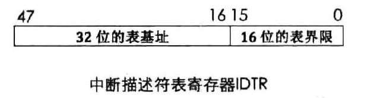
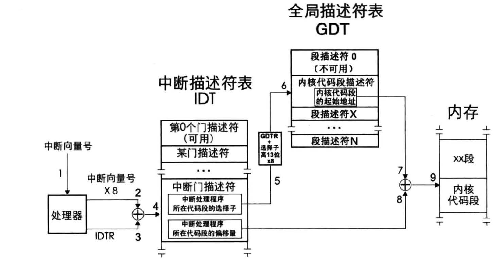
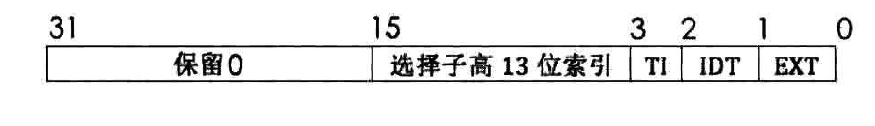
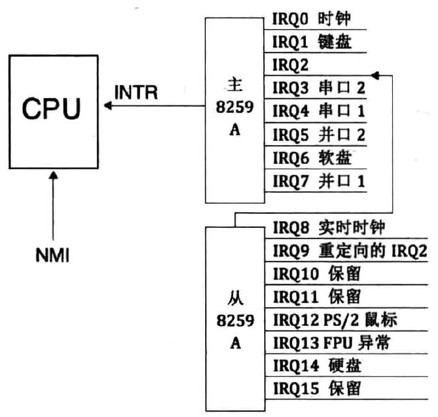
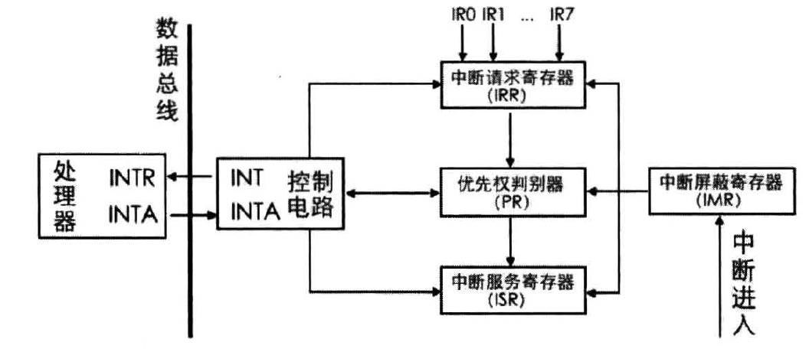

# 中断
当程序运行时，系统调用，任务的并发切换都是借用中断机制完成。
## 并发与并行
这里解释下并发和并行的区别:并发指的是单位时间内的累积工作量,比如每秒井发数是 100,
这是指一秒内累积的请求量总和为 100 个请求,属于井发。并行是指真正同时进行的工作量,比如并行
100 个请求量是指任意瞬 间都有 100 个请求在发生,所以单核 CPU 谈井发,多核 CPU 谈并行。
## 中断类型
### 内部中断
软中断：\
软中断由程序通过调用中断号自行发起。\
异常:\
是指令执行期间 CPU 内部产生的错误引起的。
>(1) Fault,也称为故障。这种错误是可以被修复的一种类型,属于最轻的 一种异常,它给软件一 次“改过自新”的机会。当发生此类异常时 CPU 将机器状态恢复到异常之前的状态,之后调用中断处理程序时,
臼U 将返回地址依然指向导致 fault 异常的那条指令。通常中断处理程序中会将此问题修复,待中断处理程序返回后便能重试。最典型的例子就是操作系统课程中所说的缺页异常 page fault ,话说 Linux 的虚拟内存就是基于 page fault 的,这充分说明这种异常是极易被修复的,甚至是有益的。\
(2) Trap ,也称为陷阱,这一名称很形象地说明软件掉进了 CPU 设下的陷阱,导致停了下来。此异常通常用在调试中,比如 int3 指令便引发此类异常,为了让中断处理程序返回后能够继续向下执行, CPU将中断处理程序的返回地址指向导致异常指令的下一个指令地址。\
(3) Abort,也称为终止,从名字上看,这是最严重的异常类型, 一旦出现,由于错误无法修复,程序将无法继续运行,操作系统为了自保,只能将此程序从进程表中去掉。导致此异常的错误通常是硬件错误,或者某些系统数据结构出错。

### 外部中断
CPU 为大家提供了两条信号线。外部硬件的中断是通过两根信号线通知 CPU 的,这两根信号线就是INTR (INTeRrupt )和 NMI (Non Maskable Interrupt )。\
可屏蔽中断：\
通过INTR接入的都是可屏蔽中断。\
可屏蔽的意思是此外部设备发出的中断, CPU 可以不理会,因为它不会让系统右机,所以可以通过 eflags寄存器的 IF 位将所有这些外部设备的中断屏蔽。\
对于这类可屏蔽中断, CPU 可以选择不用理会,甚至,即使在理会后,也可以像 Linux 那样,把中断分为上半部和下半部分开处理。\
不可屏蔽中断：\
不可屏蔽中断是通过 NMI 引脚进入 CPU 的,它表示系统中发生了致命的错误。如内存读写错误。
## 中断描述符表
中断信号有对应的处理程序。中断产生的中断号就是中断处理程序对应的描述符在中断描述符表IDT对应的偏移量。\
中断门包含了中断处理程序所在段的段选择子和段内偏移地址。当通过此方式进入中断后,标志寄存
器 eflags 中的 E 位自动置 0 ,也就是在进入中断后,自动把中断关闭,避免中断嵌套。 Linux 就是利用中
断门实现的系统调用,就是那个著名的 int 0x80 。中断 门只允许存在于 IDT 中。描述符中中断门的 type 值为二进制1110\
中断描述符表中除了中断门描述符之外还有任务门，陷阱门
>还记得很久很久以前说过的低端 1 队在B 内存布局吗?位于地址。~ 0x3ff 的是中断向量表 IVT ,它是实模式下用于存储中断处理程序入口的表。由于实模式下功能有限,运行机制比较“死板飞所以它的位置是固定的,必须位于最低端。大家看到了,己知 0~0x3ff 共 1024 个字节,又知 IVT 可容纳 256 个中断向量,所以每个中断向量用 4 字节描述 。

对比中断向量表,中断描述符表有两个区别 。\
(1)中断描述符表地址不限制,在哪里都可以 。\
(2)中断描述符表中的每个描述符用 8 字节描述。\
IDTR 寄存器用来存放中断描述符的地址
  
## 中断处理过程
CPU 外:外部设备的中断由中断代理芯片接收,处理后将该中断的中断向量号发送到 CPU 。\
CPU 内: CPU 执行该中断向量号对应的中断处理程序。\
(1)处理器根据中断向量号找到中断门描述符\
(2)处理器进行特权级检查。\
当前特权级 CPL 必须在门描述符 DPL 和门中目标代码段 DPL 之间。这是为了防止位于3特权级下的用户程序主动调用某些只为内核服务的例程。
>(a)如果是由软中断 int n, int3 和 into 引发的中断,这些是用户进程中 主动发起的中断,由用户代码控制,处理器要检查当前特权级 CPL 和门描述符 DPL ,这是检查进门的特权下限,如果 CPL 权限大于等于 DPL ,即数值上 CPL~三门描述符 DPL ,特权级“门槛”检查通过,进入下一步的“门框”检查。否则,处理器抛出异常 。\
(b)这一步检查特权级的上限(门框):处理器要检查当前特权级 CPL 和门描述符中所记录的选择子对应的目标代码段 DPL ,如果 CPL 权限小于目标代码段 DPL ,即数值上 CPL>目标代码段 DPL ,检查通过 。 否则 CPL 若大于等于目标代码段 DPL ,处理器将引发异常,也就是说,除了用返回指令从高特权级返回,特权转移只能发生在由低向高。

(3 )执行中断处理程序。

中断发生后, eflags 中的 NT 位和 TF 位会被置 0 。如果中断对应的门描述符是中断门,标志寄存器 eflags中的 IF 位被自动置 0 ,避免中断嵌套,即中断处理过程中又来了个新的中断,这是为防止在处理某个中断的过程中又来了个相同的中断,即同一种中断未处理完时又来了一个,这会导致一般保护性( GP )异常。\
这表示默认情况下,处理器会在无人打扰的方式下执行中断门描述符中的中断处理例程。\  
若中断发生时对应的描述符是任务门或陷阱门的话,CPU 是不会将 IF 位清 0 的 。 因为陷阱门主要用于调试,它允许 CPU 响应更高级别的中断,所以允许中断嵌套。\
TF 位：陷阱标志\
用在调试环境中,当
TF 为 0 时表示禁止单步执行,也就是说,进入中断后将 TF 值为 0 ,表示不允许申断处理程序单步执行。\
NT 位：任务嵌套标志\
当任务门存在嵌套调用时，系统可以通过tss段中指向上一个任务的指针找到上一个任务的tss段。
## 中断发生时栈的变化
>所以,当前进程被中断打断后,为了从中断返回后能继续运行该进程,处理器自动把 cs 和 EIP 的当前值保存到中断处理程序使用的栈中。\
除了要保存cs 、 EIP 外,还需要保存标志寄存器 EFLAGS ,如果涉及到特权级变化,还要压入 SS 和 ESP 寄存器。

(1)检查是否有特权级的转变
如果门描述中段选择子的 DPL 小于 CPL。则要向高特权级转移。特权级的转移同时还伴随着特权等级栈的切换。\
首先将旧的esp和ss寄存器中的内容临时保存，再将新的栈地址加载到寄存器esp和ss中。将之前保存的esp_old ss_old再次压入栈中保存。
(2)在新栈中压入EFLAGS 寄存器。\
(3 )由于要切换到目标代码段,对于这种段间转移,要将 cs 和 EIP 保存到 当前枝中备份,记作 CS_old和 EIP_old ,以便中断程序执行结束后能恢复到被中断的进程。
中断处理完成后利用栈中保存的cs_old eip_old结合指令iret返回原有的调用段
(4)某些异常会有错误码,此错误码用于报告异常是在哪个段上发生的,也就是异常发生的位置,所以错误码中包含选择子等信息, 一会介绍。错误码会紧跟在 EIP 之后入拢,记作 ERROR CODE。\
  
>IDT 表示选择子是否指向中断描述符表 IDT, IDT 位为 1 ,则表示此选择子指向中断描述符表,否则
指向全局描述符表 GDT 或局部描述符表 LDT 。
U 和选择子中 η 是一个意思,为 0 时用来指明选择子是从 GDT 中检索描述符,为 1 时是从 LDT 中
检索描述符。当然,只有在 IDT 位为 0 时 Tl 位才有意义。
选择子高 13 位索引就是选择子中用来在表中索引描述符用的下标。
高 16 位是保留位,全 0 。\
有时候不仅错误码的高 16 位全为 0 ,低 16 位也全为 0 ,那一个全 0 的错误码能指明什么信息?当全
0 的错误码出现时,表示中断的发生与特定的段无关,或者引用了一个空描述符,引用描述符就是往段寄
存器中加载选择子的时候,处理器发现选择子指向的描述符是空的。
# 可编程中断控制器 8259A 
8259A 的作用是负责所有来自外设的中断,其中就包括来自时钟的中断。同一时间可能会有多个外设发出中断请求。为了存储并处理这些中断，使用统一的中断控制芯片管理。
## 连级
一个8259A芯片只有八个端口，但是一共有256个中断号。连级的方式可以支持更多种类的中断。多个练级的芯片中只有一个是主片直接连接cpu,其余都通过一个端口层层相连。
  
## 芯片构造
工作原理：
  
INT: 8259A 选出优先级最高的中断请求后,发信号通知 CPU 。\
INTA: INT Acknowledge ,中断响应信号 。 位于 8259A 中的 INTA 接收来自 CPU 的接口的中断响应信号。\
IMR: Interrupt Mask Register ,中断屏蔽寄存器,宽度是 8 位,用来屏蔽某个外设的中断 。\
IRR: Interrupt Request Register ,中断请求寄存器,宽度是 8 位。它的作用是接受经过 IMR 寄存器过滤后的中断信号并锁存,此寄存器中全是等待处理的中断,“相当于” 5259A 维护的未处理中断信号队列 。\
PR: Priority Resolver ,优先级仲裁器 。 当有多个中断同时发生,或当有新的中断请求进来时,将它与当前正在处理的中断进行比较,找出优先级更高的中断。\
ISR: In-Service Register,中断服务寄存器,宽度是 8 位。当某个中断正在被处理时,保存在此寄存器中。\
处理流程：

>此处的优先级决判很简单,就是 IRQ 接口号越低,优先级越大,所以 IRQO 优先级最大。

在 8259A 内部有两组寄存器,一组是初始化命令寄存器组,用来保存初始化命令字 ICW 共 4 个, ICW1 ~ICW4 。另一组寄存器是操作命令寄存器组,用来保存操
作命令字 OCW 共三个, OCWl ~OCW3.