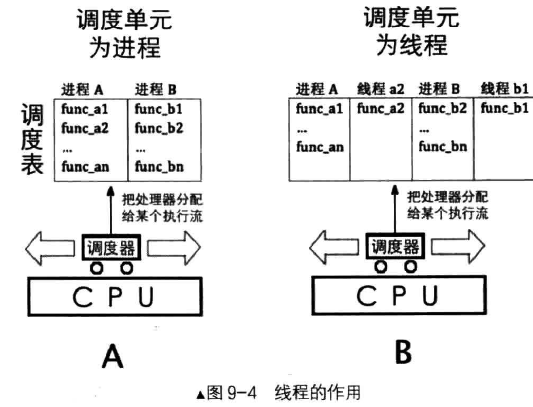
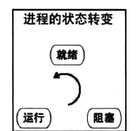
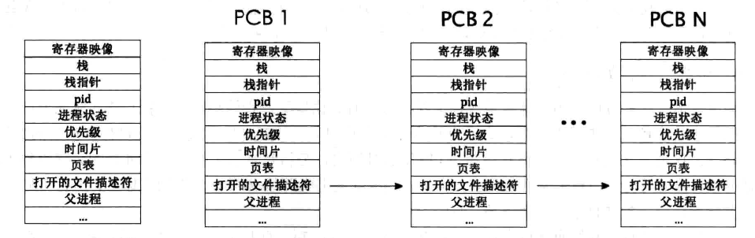

# 进程与线程
进程是最小的资源分配单位，线程是最小的任务调度单位。
>我们在操作系统课程中学过,每个进程都运行在自己的地址空间中,话说有内存空间才能存储资源,
因此进程拥有此程序运行所需的全部资源。默认情况下进程中只有一个执行流,即一个进程只能干一件事。只不过线程不包括位于进程中的、自己所需要的资掠,言外之意是线程没有自己独享的地址空间,
没空间就无法存储自己的资源,所以钱程必须“活”在进程的世界里,借助进程空间中的资源运行。有些情况下,我们需要在一个地址空间中存在多个执行流,即让进程同时“并行”做很多事,这多个执行
流指的就是线程。

>强调下,只有线程才具备能动性,它才是处理器的执行单元,因此它是调度器眼中的调度单位。进程
只是个资源整合体,它将进程中所有线程运行时用到资源收集在一起,供进程中的所有线程使用,

处理器并没有进程和线程的概念。这一切都是人为抽象出来的。处理器只知道取指和执行。\
只要将执行的上下文保存起来，
线程只能被处理器执行，但本身并不具有资源。线程在进程中使用进程具有的内存等资源。\
  
## 线程提升执行速度的原理
1.处理器多执行自己进程中的代码
>,此时系统中 一共有 2 个任务,进程 A 和进程 B ,进程 A 为了提速,创建了 3 个线程,任务调度器中便有了 4 个执行流(不包括主线程),其中有 3 个都属于进程 A,也就是说这调度器把所有任务调度 一 圈后,进程 A 相当于被处理器执行了三次,而进程 B 只在处理器上运行了 一次,进程 A 当然执行得快了。
2.线程另 一个提速的原理是避免了阻塞整个进程
## 进程与线程的状态
  
>为此,操作系统把进程“执行过程”中所经历的不同阶段按状态归为几类,注意,强调的是“执行过
程飞意为进程的状态描述的是进程中有关“动作”的执行流部分,即线程,而不包括静止的资源部分。把上述需要等待外界条件的状态称为“阻塞态飞把外界条件成立时,进程可以随时准备运行的状态称为“就绪态”,把正在处理器上运行的进程的状态称为“运行态”。
## 进程的身份证——PCB
  
PCB 没有具体的格式,其实际格式取决于操作系统的功能复杂度。进程使用的栈也属于 PCB 的一部分，但是该栈为内核栈。“寄存器映像”的位置并不固定,原因就是“寄存器映像”存储到内核栈中,因此,线程要么在 O 特权级的内核空间中实现,要么在 3 特权级的用户空间实现。
## 用户级线程与内核线程
用户级线程：\
操作系统层面并不支持，cpu不知道进程内部的线程。因此线程的调度需要用户自己编写。\
同时线程的切换也不需要进入内核，节省了陷入内核的时间。\
但与此同时也无法向前文中所说那样用更多的执行流去争抢cpu资源。
内核线程：
>(1 )相比在用户空间中实现线程,内核提供的线程相当于让进程多占了处理器资源,比如系统中运行有
进程 A 和一传统型进程 B ,此时进程 A 中显式创建了 3 个线程,这样一来,进程 A 加上主线程便有了 4 个线
程,加上进程 B ,内核调度器眼中便有了 5 个独立的执行流,尽管其中 4 个都属于进程 A,但对调度器来说这 4
个线程和进程一样被调度,因此调度器调度完一圈后,进程 A 使用了 80% 的处理器资源,这才是真正的提速。\
(2 )另一方面的优点是当进程中的某一线程阻塞后 , 由于线程是由内核空间实现的,操作系统认识线
程,所以就只会阻塞这一个线程,此线程所在进程内的其他线程将不受影响,这又相当于提速了 。
缺点是用户进程需要通过系统调用陷入内核,这多少增加了 一些现场保护的枝操作,这还是会消耗一
些处理器时间,但和上面的大幅度提速相比,这不算什么大事。
# 内核线程的实现
需要的数据结构：
内核线程在同一时间内只有一种状态。因此使用联合体来标记内核线程的状态。一个内核线程有六种状态。
```c
enum task_stat{
    TASK RUNNING,//运行
    TASK_READY,//就绪
    TASK_BLOCKED,//锁
    TASK_WAITING,//等待
    TASK_HANGING,//挂起
    TASK DIED//死亡
};
```
用于在中断来时保存程序运行的上下文内容。进程或线程被外部中断或软中断打断时,会按照此结构压入上下文。方便以后恢复执行
```c
struct intr_stack {
    uint32_t vec_no;	 // kernel.S 宏VECTOR中push %1压入的中断号
    uint32_t edi;
    uint32_t esi;
    uint32_t ebp;
    uint32_t esp_dummy;	 // 虽然pushad把esp也压入,但esp是不断变化的,所以会被popad忽略
    uint32_t ebx;
    uint32_t edx;
    uint32_t ecx;
    uint32_t eax;
    uint32_t gs;
    uint32_t fs;
    uint32_t es;
    uint32_t ds;

    /* 以下由cpu从低特权级进入高特权级时压入 */
    uint32_t err_code;		 // err_code会被压入在eip之后
    void (*eip) (void);//指令指针
    uint32_t cs;
    uint32_t eflags;
    void* esp;
    uint32_t ss;
};
```
线程自己在运行时也需要有自己独立的栈,用来保存执行时的信息以便于
```c
struct thread_stack {
    uint32_t ebp;
    uint32_t ebx;
    uint32_t edi;
    uint32_t esi;

    /* 线程第一次执行时,eip指向待调用的函数kernel_thread 
    其它时候,eip是指向switch_to的返回地址*/
    void (*eip) (thread_func* func, void* func_arg);

    /*****   以下仅供第一次被调度上cpu时使用   ****/

    /* 参数unused_ret只为占位置充数为返回地址 */
    void (*unused_retaddr);
    thread_func* function;   // 由Kernel_thread所调用的函数名
    void* func_arg;    // 由Kernel_thread所调用的函数所需的参数
};
```
为何需要保存ebp等四个寄存器？\
按照函数调用时的约定，由被调用的函数主动保存这四个寄存器的值，在返回时将寄存器内的值恢复。
>第 1 个作用是在线程首次运行时,线程技用于存储创建线程所需 的相关数据 。和线程有关的数据应该都在该
线程的 PCB 中,这样便于线程管理,避免为它们再单独维护数据空间。 创建线程之初,要指定在线程中运行的
函数及参数,因此,把它们放在位于 PCB 所在页的高地址处的 o 级战中比较合适,该处就是线程拢的所在地址。\
第 2 个作用是用在任务切换函数 switch to 中的,这是线程已经处于正常运行后线程技所体现的作用。
为解释清楚这个疑惑,现在不得不告诉大家 switch to 函数是我们用 汇编语言实现的 ,它是被内核调度器
函数调用的,因此这里面涉及到主调函数寄存器的保护,就是 ebp、 ebx, edi 和 esi 这 4 个寄存器,前面
f 那段英文己经阐述了,它们属于主调函数 (这里是指调度器函数) ,咱们要在被调用函数 switch to 中将它
们保护起来,也就是将它们保存在校中,这必然涉及到压战指令 push ,用单纯的汇编语 言 比 C 语 言 内嵌
汇编的方式要方便一些,请大伙儿见谅 。