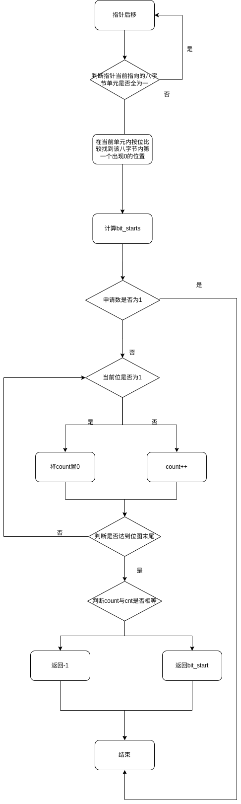

# 实现断言
## 什么是断言
断言（Assertion）是一种在程序中插入的一种声明，用于指定程序在运行到此处时某个条件应该为真。断言通常用于检查程序的内部状态是否符合预期，以确保程序的正确性。如果断言的条件不为真，系统就会触发一个断言失败，通常伴随着相关信息的输出，帮助程序员识别问题的根本原因。\
在C语言中，通常使用assert宏来实现断言。其基本形式如下：\

```c
#include <assert.h>

int main() {
    int x = 5;
    
    assert(x == 5);

    // Rest of the program

    return 0;
}
```
在这个例子中，assert(x == 5); 断言 x 的值应该为 5。如果这个条件不成立，assert 宏会触发一个断言失败，并输出一条包含相关信息的错误消息。在发布版本的程序中，通常会关闭断言，以避免在生产环境中触发不必要的错误。\
## 如何实现断言
观察断言的形式我们可以联想到使用宏来实现。\
先定义宏ASSTRE，它需要一个参数，该参数是判断的是否调用中断的依据。
```c
#ifdef NDEBUG
    #define ASSERT(CONDITION)((void)0) 
#else
    #define ASSERT(CONDITION)\
    if(CONDITION){              \
                                \
    }else{                      \
        PANIC_SPIN(#CONDITION); \
    }                           
#endif
```
如果不需要宏的时候将宏的内容定义为空，减小程序的体积在宏。#将PANIC_SPIN中的CONDITION转换为字符串
```c
#define PANIC_SPIN(...)(__FILE__, __LINE__, __func__, __VA_ARGS__) 
```
__FILE__ __LINE__ __func__\
这三者是编译器预定义的宏，分别代表文件名，行数,函数名。
__VA_ARGS__与前面的...配合表示变长参数。
在函数panic_spin中，将开启中断
```c
void panic_spin(char* file, int line, char* func, char* condition);
```
当使用PANIC_SPIN宏时，它会将当前文件名、行号、函数名以及传递给宏的其他参数传递给panic_spin函数，函数中执行打印函数将错误信息打印出来，并进入死循环使程序悬停在此处。
# 实现字符串库
# 位图
在管理内存时，用bitmap来表示操作系统中的页是否被使用。若被使用则将与内存对应的那个位写为1,否则为0。\
用结构体来储存一个位图的信息。其中包括位图开始的头指针，和位图的大小。
相关的操作：\
1.初始化位图\
2.将某一位置为0/1\
3.查找未被使用过的位图：\
  
# 内存池与内存分配
本章节只实现了一整页一整页的分配，并未实现粒度化的分配
结构体：
物理内存和虚拟内存都需要同时进行管理，因此需要两个结构体类型分别来记录虚拟内存池和物理内存池。
物理内存池：
物理内存池中记录了物理内存总量，物理内存的起始地址以及位图
```c
struct mem_pool
{   
    struct bitmap      ;  // 本内存池用到的位图结构,用于管理物理内存
    uint32_t phy_addr_start;  // 本内存池所管理物理内存的起始地址
    uint32_t pool_size; //物理内存总量
};
```
虚拟内存池：
虚拟内存池内记录了位图的起始位置起始的位置以及虚拟内存的位图
```c
struct virtual_addr {
   struct bitmap vaddr_bitmap; // 虚拟地址用到的位图结构 
   uint32_t vaddr_start;       // 虚拟地址起始地址
};
```
将内存池的位图放于低1MB的空间内，此处物理地址与虚拟地址一一对应可以简化管理。且前1M内存在初始化时已经默认全部用完。\
功能：\
1.初始化内存池
2.分配一个虚拟内存地址
判断虚拟地址对应的页目录项是否存在，如果不存在分配页表并将页表
3.分配物理内存页
4.获取虚拟地址的页目录项指针和页表指针
