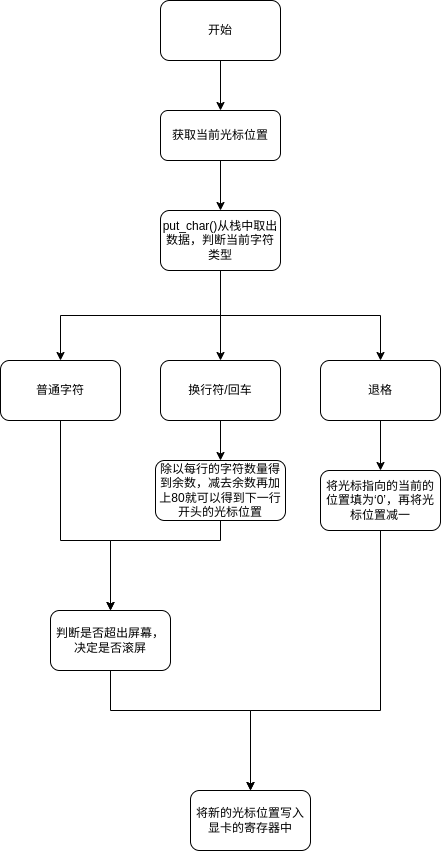
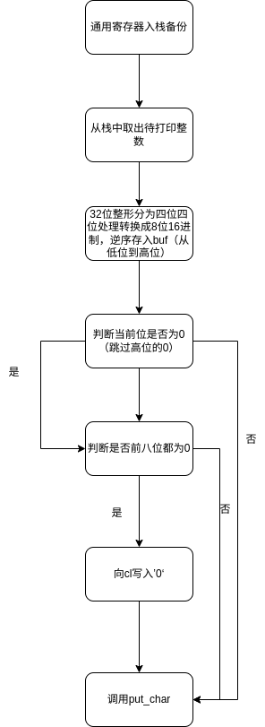
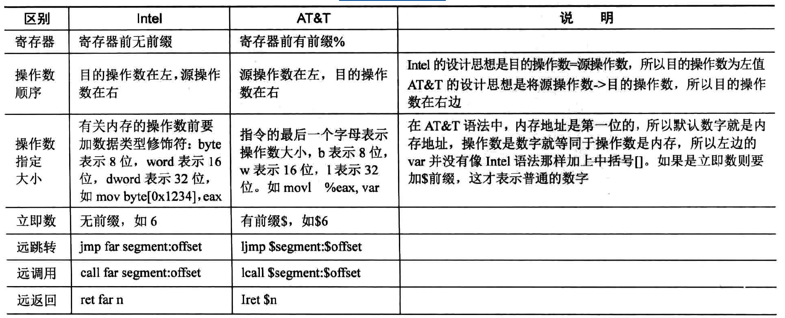
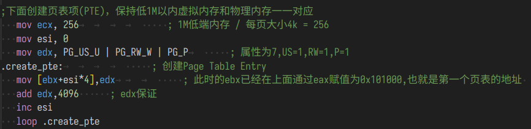
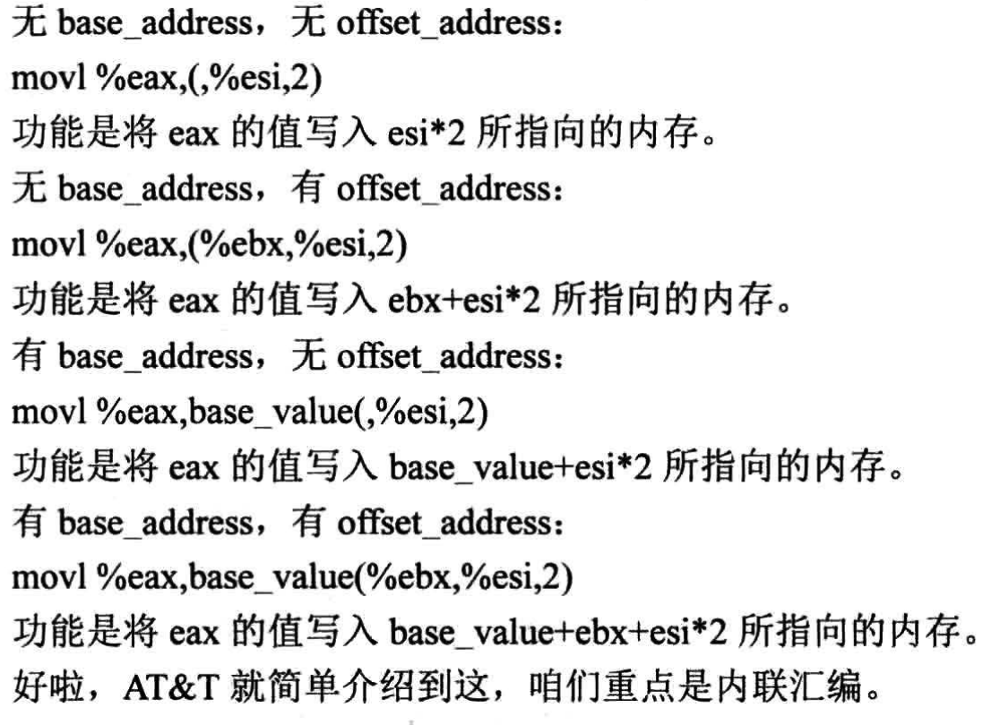

# 汇编与c混合编程
汇编语言和 C 语言混合编程可分为两大类。\
(1)单独的汇编代码文件与单独的 C 语言文件分别编译成目标文件后, 一起链接成可执行程序。\
(2)在 C 语言中嵌入汇编代码,直接编译生成可执行程序。(内联汇编)
系统调用很像 BIOS 中断调用(在很久很久以前咱们有说过 BIOS 中断、 DOS 中断等内容),只不过
系统调用的入口只有 一个,即第 Ox80 号中断。\
为什么系统调用只有一个入口呢?\
中断向量表中有诸多预留位置给中断程序，系统调用只用0x80号中断，具体的中断方式由eax指定。\
BIOS 中断走的是中断向量表,所以有很多中断号给它用,而系统调用走的是中断描述符表中
的一项而己,所以只用了第 Ox80 项中断。
调用“系统调用”有两种方式。\
(1) 将系统调用指令封装为 c 库函数,通过库函数进行系统调用,操作简单。\
(2)不依赖任何库函数,直接通过汇编指令 int 与操作系统通信。\
## c语言汇编时参数传递的规则

# 实现打印函数
## 步骤
打印一共可以分为一下几步\
1.获取光标当前的位置\
2.判断要打印的字符是否是正常的字符\
3.如果是正常字符，直接打印，如果是回车或者换行符等等，进入处理函数。
4.判断输出该字符输出后是否超出屏幕，若超出屏幕将后3840个字节向前移动
5.将移动后光标的位置写入端口内。



  

## 外设端口
显卡的端口众多，为了方便管理，显卡只向外提供写端口与读端口。通过向写端口中写入待访问的索引号来访问显卡中相应的端口。
通过读端口来读取显卡中的内容。
# 内联汇编
c语言并没有办法直接操作寄存器，为了实现对硬件更加精细的操纵，需要通过内联汇编的方式。
##  AT&T 汇编风格

寻址：


## 基本内联汇编
```c
asm [volatile] ("assembly code")
```
asm 和_asm_是一样的,是由 gee 定义的宏: #define 一部m一 副m 。
因为 gee 有个优化选项,0 ,可以指定优化级别。当用-0 来编译时, gee 按照自己的意图优化代码,说不定就会把自己所写的代码修改了。关键宇 volatile 是可选项,它告诉 gee :“不要修改我写的汇编代码”\
请原样保留”。 volatile 和一volatile一是一样的,是由 gee 定义的宏: #define_volatile_ volatile 。\
“assembly eode”是咱们所写的汇编代码,它必须位于圆括号中,而且必须用双引号引起来。这是格式要求,只要满足了这个格式 asm [volatile] (“”), assembly eode 甚至可以为空。\
(1)指令必须用双引号引起来,无论双引号中是一条指令或多条指令。\
(2) 一对双引号不能跨行,如果跨行需要在结尾用反斜杠转义。\
(3)指令之间用分号“;”、换行符“\n”或换行符加制表符"\n\t"分隔。\
## 扩展内联汇编
为了解决不知道那些寄存器被使过，数据到底被存入哪个寄存器。内联汇编有自己的一套规则
### 约束词

### 占位符
