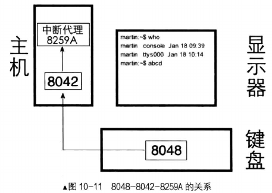

# 同步机制——锁
## 代码中的临界区互斥竞争
* 公共资源\
可以是公共内存、公共文件、公共硬件等,总之是被所有任务共享的一套资源。
* 临界区\
程序要想使用某些资源,必然通过一些指令去访问这些资源,若多个任务都访问同一公共资源,那么
各任务中访问公共资源的指令代码组成的区域就称为临界区。怕有同学看得不仔细,强调一下,临界区是
指程序中那些访问公共资源的指令代码,即临界区是指令,并不是受访的静态公共资源。
* 互斥\
互斥也可称为排他,是指某一时刻公共资源只能被 1 个任务独享,即不允许多个任务同时出现在自己的临界
区中。公共资源在任意时刻只能被一个任务访问,即只能有一个任务在自己的临界区中执行,其他任务想访问公共资源时,必须等待当前公共资源的访问者完全执行完他自己的临界区代码后(使用完资源后)再开始访问。
* 竞争条件\
竞争条件是指多个任务以非互斥的方式同时进入临界区,大家对公共资源的访问是以竞争的方式并行
进行的,因此公共资源的最终状态依赖于这些任务的临界区中的微操作执行次序。
## 竞争的产生
在上一章中，实现了最基础的任务调度。但是在多任务的环境下，新的问题又诞生了。\
以上节中的代码为例，在线程A和线程B打印时，可能会打印出混乱的字符串。甚至是导致寄存器中内容的混乱。\
这一切都是因为线程的频繁切换。\
假设有线程A与B。当A正在打印时字符串时，此时时钟中断打断了线程A的执行，在时钟中断的处理函数之中，处理函数发现A的时间片已经耗尽。之后便调用调度函数将B线程切换上cpu执行。但在A此时字符串尚未打印完，便被换下cpu换为线程B。寄存器的混乱便是由此引起。\
为了解决这个问题可以在打印前将中断关闭。但是如此每个涉及到竞争的操作都要先关闭中断再开启中断，非常的麻烦。\
为了更加方便的将诸多执行流隔离开免得数据之间的混乱，因此引入锁机制来保证操作的原子性。

>多线程访问公共资源时出问题的原因是产生了竞争条件,也就是多个任务同时出现在自己的临界区 。 为避免产生竞争条件,必须保证任意时刻只能有一个任务处于临界区 。 因此,只要保证各线程自己临界区中的所有代码都是原子操作,即临界区中的指令要么一条不做,要么 一气呵成全部执行完,执行期间绝对不能被换下处理器 。\
其实,之所以出现竞争条件,归根结底是因为临界区中的指令太多了,如果临界区仅有一 条指令的话,
这本身已属于原子操作,完全不需要互斥。因此,在临界区中指令多于一条时才需要互斥 。当 然,临界区
中很少存在只有一条指令的情况,因此我们必须提供一种互斥的机制,互斥能使临界区具有原子性,避免
产生竞争条件,从而避免了多任务访问公共资源时出问题。
## 信号量
定义：在计算机中,信号量就是个 0 以上的整数值,当为 0 时表示己无可用信号 ,或者说条件不再允许,因
此它表示某种信号 的累积“ 量飞故称为信号量。
  
## 锁的基础——线程的阻塞
线程阻塞：
1.获取当前线程的task_pcb\
2.关中断\
3.判断当前线程是否在就绪队列中\
4.修改线程状态\
5,调用调度函数，切换为其他线程\
线程解除阻塞：
1.关中断\
2.判断待唤醒线程的状态
3.将待唤醒线程放入就绪队列的头部

## 锁与信号量的实现
信号量结构：
```c
struct semaphore {
   uint8_t  value;//信号量的值
   struct   list waiters;//在同一个锁上阻塞的任务队列
};
```
锁结构：
```c
struct lock {
   struct   task_struct* holder;	    // 当前锁的持有者
   struct   semaphore semaphore;	    // 用二元信号量实现锁
   uint32_t holder_repeat_nr;		    // 锁的持有者重复申请锁的次数
};
```
1.初始化信号量\
2.初始化锁\
3.信号量的down操作\
4.信号量up操作\
5.获取锁\
6.释放锁\
加锁解锁
  

  

# 键盘的输入输出
## 终端
在操作系统真相还原中只实现一个终端。\
终端的定义：终端的构造原理很简单,就是把用户键入的命令传送到主机,待主机运算完成后再将结果送回给用户,
终端不提供任何额外功能,仅是个显示窗口。
## 输出
在终端输出的设计中，为了防止线程切换导致的输出内容的混乱，需要初始化锁来保证操作的原子性，在此基础上封装字符打印相关的函数
## 输入
### 硬件支持
#### 芯片: 8048
键盘是个独立的设备,在它内部有个叫作键盘编码器的芯片,通常是 Intel 8048 或兼容芯片,它的作
用是:每当键盘上发生按键操作,它就向键盘控制器报告哪个键被按下,按键是否弹起。
这个键盘控制器可并不在键盘内部,它在主机内部的主板上,通常是 Intel 8042 或兼容芯片,它的作用是
接收来自键盘编码器的按键信息,将其解码后保存然后向中断代理发中断,之后处理器执行相应键被接下的中断处理程序读入 。 当键盘上发生按键操作 上的芯片,其主要责任就是监控。\
  
键盘每个键位都有通断两种状态，为了让cpu知道究竟是哪个键位进行了操作，是什么状态，由此引入键盘扫描码的概念。\
该组编码为键盘上不同的键位都编制了通码和断码来表示键盘的使用情况。\
键盘随着时代变更一直在改变，键盘扫描码也在改变。如何让cpu知道此时使用的是哪套键盘扫描码？\
此处引入硬件芯片8042，它将键盘扫描码转换成第一套扫描码。键盘的中断处理程序中只处理第一套键盘扫描码就可以了。\
#### 8042
Intel 8042 芯片或兼容芯片被集成在主板上的南桥芯片中,它是键盘控制器,也就是键盘的 IO 接口。\
因此它是 8048 的代理,也是前面所得到的处理器和键盘的“中间层”。 8048 通过 PS/2 、 USB 等接口与 8042通信,处理器通过端口与 8042 通信( IO 接口就是外部硬件的代理,它和处理器都位于主机内部,因此处理器与 IO 接口可以通过端口直接通信)。
  

### 处理过程
* 扫描码有 3 套,现在一般键中的 8048 芯片支持的是第二套扫描码 。 因此每当有击键发生时, 8048
发给 8042 的都是第二套键盘扫描码。
* 8042 为了兼容性,将接收到的第二套键盘扫描码转换成第一套扫描码。 8042 是按字节来处理的,
每处理一个字节的扫描码后,将其存储到自己的输出缓冲区寄存器 。
* 然后向中断代理 8059A 发中断信号,这样我们的键盘中断处理程序通过读取 8042 的输出缓冲区
寄存器,会获得第一套键盘扫描码。
## 键盘驱动

# 缓冲区